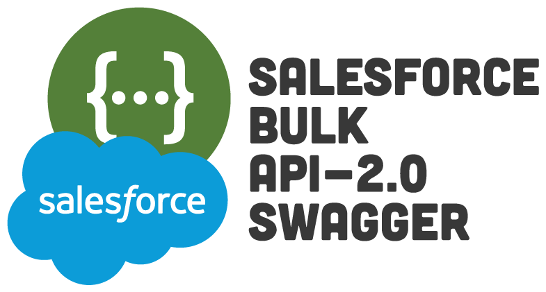

  

<h3 align="center">Salesforce Bulk API-2.0 Swagger</h3>

---

 This is just an Open API (Swagger) document that describes Salesforce's Bulk API 2.0.
      

## Table of Contents

- [Table of Contents](#table-of-contents)
- [About ](#about-)
- [Authors ](#authors-)

## About 

I really like the Open API style of documenting an API. I really wish Salesforce would start to adopt this more in their docs. Not only does it make it asy for developers to reason about but it also makes it super easy to virtualize in an API Gateway. So after about a minute of Googling and not finding a Swagger file for Salesforce's Bulk API 2.0 that was to my liking, I decided to make my own and share it with everyone.

I'm no Swagger Wizard to be sure, but I think this one is pretty comprehensive, with descriptions, and examples. Wherever possible, I tried to pull the descriptions right from Salesforce's documentation.

If you find any issue, feel free to submit an issue or, even better, a pull request.

[Salesforce's Bulk API 2.0 Docs](https://developer.salesforce.com/docs/atlas.en-us.api_asynch.meta/api_asynch/bulk_api_2_0.htm)

## Authors 

- [@codysechelski](https://github.com/codysechelski) - Idea & Initial work
